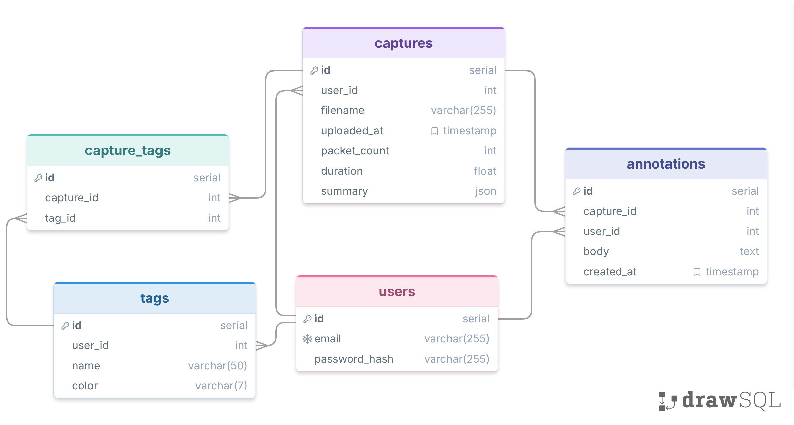

# PacketScope — Backend

**The FastAPI + PostgreSQL API behind PacketScope.**

This repository is the **backend** for PacketScope, a network packet-capture analysis app. It handles authentication, full CRUD for captures, notes and tags, and parses uploaded `.pcap` files with [Scapy](https://scapy.net/) into a compact traffic summary.

🖥️ **Frontend repo:** [packetscope-front-end](https://github.com/dana12812/packetscope-front-end)

---

## Table of contents

1. [Data model (ERD)](#data-model-erd)
2. [API endpoints](#api-endpoints)
3. [Packet parsing](#packet-parsing)
4. [Authentication & authorization](#authentication--authorization)
5. [Technologies used](#technologies-used)
6. [File Structure](#file-structure)

---


## Data model (ERD)



Interactive version: [PacketScope on DrawSQL](https://drawsql.app/teams/dana-alsaleh/diagrams/packetscope)

Four tables plus a join table:

| Table | Purpose | Key relationships |
|---|---|---|
| `users` | Registered accounts | Owns captures, annotations and tags |
| `captures` | An uploaded `.pcap` and its summary | Belongs to a user; has many annotations |
| `annotations` | Notes on a capture | Belongs to a capture and a user |
| `tags` | Color-coded labels | Belongs to a user |
| `capture_tags` | Join table | Links captures ↔ tags (many-to-many) |

Relationships: `users → captures`, `users → annotations`, `users → tags`, `captures → annotations`, and `captures ↔ tags` through `capture_tags`.

## API endpoints

All routes except sign-up and sign-in require a valid JWT, and every query is scoped to the authenticated user.

| Method | Route | Description |
|---|---|---|
| POST | `/auth/sign-up` | Register a new user |
| POST | `/auth/sign-in` | Authenticate and receive a JWT |
| GET | `/captures` | List the current user's captures |
| POST | `/captures` | Upload and analyze a `.pcap` file |
| GET | `/captures/{id}` | Get one capture with its summary |
| PUT | `/captures/{id}` | Rename a capture / update its tags |
| DELETE | `/captures/{id}` | Delete a capture |
| GET | `/captures/{capture_id}/annotations` | List notes on a capture |
| POST | `/captures/{capture_id}/annotations` | Add a note |
| PUT | `/annotations/{id}` | Edit a note |
| DELETE | `/annotations/{id}` | Delete a note |
| GET | `/tags` | List the user's tags |
| POST | `/tags` | Create a tag |
| PUT | `/tags/{id}` | Update a tag |
| DELETE | `/tags/{id}` | Delete a tag |
| POST | `/captures/{capture_id}/tags/{tag_id}` | Attach a tag to a capture |
| DELETE | `/captures/{capture_id}/tags/{tag_id}` | Detach a tag from a capture |

## Packet parsing

When a `.pcap` is uploaded, the backend:

1. **Validates** the file — checks the type and rejects anything over the size limit, returning a clear error the frontend can show.
2. **Reads** it with Scapy's `rdpcap`, walking each packet's layers (`IP`/`IPv6`, `TCP`/`UDP`/`ICMP`).
3. **Summarizes** the traffic — protocol counts, total bytes, duration, and top source/destination IPs — and stores that summary as JSON on the `captures` row, so the dashboard loads instantly without re-parsing.

The same parsing logic is also available as a standalone CLI, `packetscope-cli`, which analyzes a capture locally and can post the summary to this API.

## Authentication & authorization

- **Passwords** are hashed with bcrypt — plaintext is never stored.
- **Sessions** use JWT access tokens issued at sign-in and sent as a `Bearer` header.
- **Authorization** — every capture, annotation and tag query is filtered by the user id in the token, so users can only read and modify their own data.

## Technologies used

| Category | Technologies |
|---|---|
| **Framework** | FastAPI, Uvicorn |
| **ORM & migrations** | SQLAlchemy, Alembic |
| **Validation** | Pydantic |
| **Database** | PostgreSQL |
| **Auth** | JWT (python-jose), bcrypt (passlib) |
| **Packet parsing** | Scapy |


## File Structure
 
```
packetscope-back-end/
├── config/
│   └── environment.py            # reads DATABASE_URL, SECRET_KEY
├── controllers/
│   ├── users.py                  # sign-up, sign-in, current user
│   ├── captures.py
│   ├── annotations.py
│   └── tags.py
├── data/
│   ├── user_data.py              # seed data per resource
│   ├── capture_data.py
│   └── tag_data.py
├── dependencies/
│   └── get_current_user.py
├── models/
│   ├── base.py
│   ├── user.py
│   ├── capture.py
│   ├── annotation.py
│   ├── tag.py
│   └── capture_tag.py            # join table (captures ↔ tags)
├── serializers/
│   ├── user.py
│   ├── capture.py
│   ├── annotation.py
│   └── tag.py
├── lib/
│   └── pcap_parser.py            # Scapy parsing → summary JSON
├── .env.example
├── .gitignore
├── Pipfile
├── Pipfile.lock
├── README.md
├── database.py
├── main.py
└── seed.py
```

**Author:** Dana AlSaleh — [GitHub](https://github.com/dana12812)